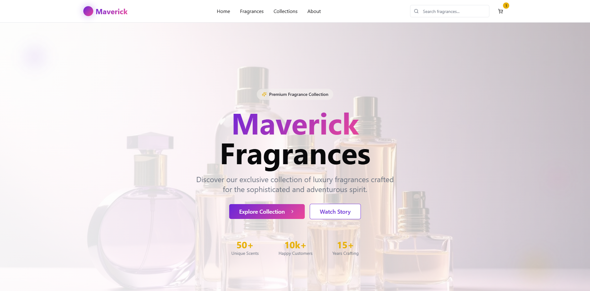

# 🌸 Maverick Fragrance

Maverick Fragrance is a modern fragrance brand and system designed to combine elegance, innovation, and personalization.  
It emphasizes a clean **UI/UX**, smooth user experience, and a luxurious identity that reflects the sophistication of the fragrance world.

---

## ✨ Features
- 🖥️ **Elegant Interface** – Minimalist design with a neat, organized layout.  
- 🌺 **Fragrance Collection** – Explore, manage, and discover unique fragrances.  
- 🧩 **Customizable System** – Flexible features tailored for branding or product showcases.  
- 📄 **Export Options** – Save and share fragrance details or brand materials.  
- 🔗 **Integration Ready** – Can link to GitHub, PDF downloads, and other resources.  

---

## 🛠️ Tech Stack (Flexible)
Maverick Fragrance can be adapted for different platforms:  
- **Frontend/UI:** React, Tailwind CSS, Radix UI, shadcn/ui, Lucide Icons  
- **Build Tools:** Vite  
- **Routing & State Management:** React Router, React Query  
- **Design System:** Class Variance Authority + Custom Components  

---

# File

[Maverick Fragrance (PDF)](./Maverick%20Fragrance.pdf)

# POS Preview

